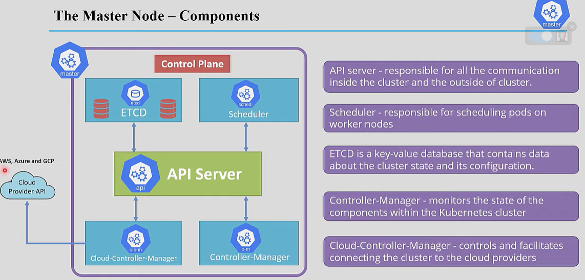

# What is Kubernetes  

If we have 3 machines, and every machine is running 100 containers,  

the manager would have to check all of them, and this looks almost impossible to handle manually.  

So, we need a bot or a system API to manage all of them directly, and that is Kubernetes.  
It is a system that uses an API to manage containers.  

Firstly, there are some simple terms we need to understand so we don't get lost.  

We said in our example that we have three machines.  
In Kubernetes, machines are called **nodes** (machine = node).  

We also said that we have 100 containers on a single machine.  
In Kubernetes, containers run inside **pods** (container runs inside a pod).  

The pod can have one or more containers. For example, a pod for web services  

has a container for the web app  
and another container that handles logs  

both containers literally run in the same pod (same IP, same network namespace).  

To conclude, the node communicates with the pod and not directly with the containers.  

# Kubernetes Cluster  

- Control Plane (Master Node) – the admin panel  
- Worker Node  

  

## Worker Node  
Gets requests from the control plane and performs actions.  

This is the node that runs the pods (containers).  

## Control Plane (Master Node)  
It is the admin of the cluster.  

You communicate with the control plane by requesting the **API Server**.  

It requires authentication using a **service account token** from inside the pod to get a response.  

This is the API Server endpoint:  

```
https://kubernetes.default.svc.cluster.local/api/v1/
```

You can use this token to call the API Server.  
Using this API endpoint, you can request cluster resources (depending on permissions):  

```
https://$KUBERNETES_SERVICE_HOST:$KUBERNETES_SERVICE_PORT/api/v1/namespaces/default/secrets
```

login into the node using the data you get and have fun :)